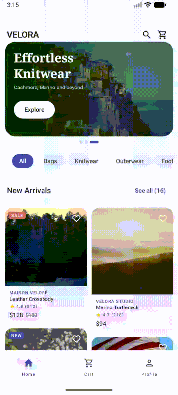
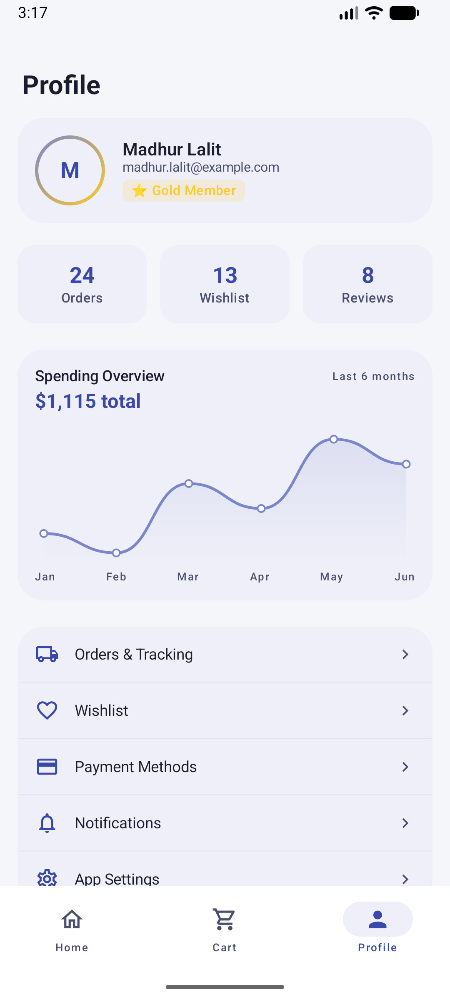

# Velora 🛍️

A **production-grade fashion e-commerce Android app** built entirely with Jetpack Compose. Demonstrates real-world MVVM-Clean Architecture patterns, reactive state management with Kotlin Coroutines & Flow, and first-class ad monetisation integration using the Apex Ads SDK.

---

## Screenshots

<p align="center">
  
  &nbsp;&nbsp;&nbsp;&nbsp;
  
</p>

<p align="center">
  <em>Home — hero carousel, category filter, staggered grid, SALE/NEW badges &nbsp;&nbsp;|&nbsp;&nbsp; Profile — Canvas LineChart, stats, account menu</em>
</p>

---

## Features

| Screen | What it does |
|--------|-------------|
| **Home** | Staggered-grid product feed with hero banners, category filtering, favourite toggle, shimmer skeleton, and inline native ads |
| **Product Detail** | Full-screen product view with image, size picker, live cart membership badge, and reactive favourite state |
| **Cart** | Swipe-to-delete items, quantity controls, rewarded-video discount offer, animated order summary |
| **Profile** | Spending overview with a custom Canvas `LineChart`, order history, account stats |

Additional highlights:
- Dark / Light theme with Material 3 dynamic colour
- Smooth Compose Navigation with type-safe routes
- Bottom navigation bar with live cart badge count
- Coil async image loading with cross-fade
- Swipe-to-dismiss cart items (Material 3 `SwipeToDismissBox`)

---

## Tech Stack

| Layer | Library / Tool |
|-------|---------------|
| UI | Jetpack Compose, Material 3, Compose Navigation |
| Architecture | MVVM, Repository pattern, Hilt DI |
| Async | Kotlin Coroutines, `StateFlow`, `SharedFlow`, `flatMapLatest`, `combine` |
| Image loading | Coil 2 |
| Ads | Apex Ads SDK (Banner, Native, Rewarded Video) |
| Build | Kotlin 2.0, KSP, Gradle Version Catalog |
| Min SDK | 21 (Android 5.0) |
| Target SDK | 35 (Android 15) |

---

## Architecture

```
app/
└── src/main/java/com/velora/app/
    ├── data/
    │   ├── model/          # Domain models: Product, CartItem, HeroBanner, UiState<T>
    │   └── repository/     # ProductRepository (interface) + FakeProductRepository
    │                       # CartRepository — @Singleton source of truth for cart state
    ├── di/
    │   └── AppModule.kt    # Hilt bindings
    ├── feature/
    │   ├── home/           # HomeScreen + HomeViewModel
    │   │   └── components/ # CategoryChips, HeroCarousel, ProductCard, ShimmerEffect
    │   ├── cart/           # CartScreen + CartViewModel
    │   ├── product/        # ProductDetailScreen + ProductDetailViewModel
    │   └── profile/        # ProfileScreen + custom LineChart
    ├── ads/
    │   └── AdComposables.kt  # BannerAdSlot, NativeAdCard
    ├── core/design/          # Color, Typography, Shape, Theme
    └── navigation/           # Screen sealed class, VeloraNavGraph
```

### Key Architecture Decisions

**Single source of truth for cart state**
`CartRepository` is a `@Singleton` injected into both `HomeViewModel` (badge count) and `CartViewModel` (cart screen). Both observe the same `StateFlow<List<CartItem>>` — no event bus, no shared preferences, no manual synchronisation needed.

**Reactive product detail loading**
`ProductDetailViewModel` uses `flatMapLatest` to chain the product `Flow` from the repository, so switching products always cancels the previous subscription before subscribing to the new one:

```kotlin
val uiState = _productId
    .flatMapLatest { id ->
        productRepository.getProduct(id)
            .map { product -> if (product != null) UiState.Success(product) else UiState.Error("Not found") }
    }
    .onStart { emit(UiState.Loading) }
    .catch { e -> emit(UiState.Error(e.message ?: "Error")) }
    .stateIn(viewModelScope, SharingStarted.WhileSubscribed(5_000), UiState.Loading)
```

**Live cart membership in product detail**
`isInCart` combines `_productId` with `cartRepository.items` so the "Add to Cart" / "In Cart" badge updates instantly when the cart changes, even while the detail screen is open:

```kotlin
val isInCart = combine(_productId, cartRepository.items) { id, items ->
    id != null && items.any { it.product.id == id }
}.stateIn(viewModelScope, SharingStarted.WhileSubscribed(5_000), false)
```

**Atomic `StateFlow` mutations**
All `MutableStateFlow` mutations use `update {}` (atomic CAS) to prevent lost-update race conditions when multiple coroutines modify state concurrently:

```kotlin
_items.update { current ->
    val idx = current.indexOfFirst { it.product.id == product.id }
    if (idx >= 0) current.toMutableList().also { it[idx] = it[idx].copy(quantity = it[idx].quantity + 1) }
    else current + CartItem(product, 1, size)
}
```

**Error propagation without crashes**
Every `suspend` call is wrapped in `runCatching`. Errors are emitted to a `MutableSharedFlow` and collected in the UI as one-shot events — the coroutine scope is never cancelled by an unhandled exception:

```kotlin
viewModelScope.launch {
    runCatching { productRepository.toggleFavourite(id) }
        .onFailure { e -> _events.emit(ProductEvent.Error(e.message ?: "Failed")) }
}
```

---

## Ad Integration

Velora integrates the **Apex Ads SDK** for three ad formats:

| Format | Placement | Trigger |
|--------|-----------|---------|
| Banner 320×50 | Home feed footer | Auto-load on composition |
| Native card | Feed every 6 items | Auto-inject by `FeedItem.NativeAdSlot` |
| Rewarded video | Cart screen | User opt-in for 20% discount |

**Memory-safe `BannerAdSlot`** — a `DisposableEffect` calls `ad.destroy()` when the composable leaves composition, preventing connection leaks:

```kotlin
DisposableEffect(placementId) {
    onDispose { adHolder[0]?.destroy(); adHolder[0] = null }
}
```

**Activity-safe rewarded video** — the `postDelayed` `ad.show()` call is guarded by a `DefaultLifecycleObserver` that cancels the pending `Runnable` if the Activity is destroyed before the 800 ms timer fires.

---

## Getting Started

### Prerequisites

- Android Studio Hedgehog (or later)
- JDK 17+
- Android SDK with API 35

### Build & Run

```bash
git clone https://github.com/Madroid2/velora-android.git
cd velora-android
./gradlew :app:installDebug
```

No API keys or environment variables are required — the app ships with a fully in-memory `FakeProductRepository` that simulates a 400–600 ms network round-trip.

### Swap in a real backend

Replace `FakeProductRepository` with a Retrofit + Room implementation that satisfies the same `ProductRepository` interface. No ViewModel changes are needed.

```kotlin
// di/AppModule.kt
@Binds
abstract fun bindProductRepo(impl: RealProductRepository): ProductRepository
// ↑ one line change; all ViewModels continue to work unchanged
```

---

## Project Highlights for Interviewers

| Topic | Where to look |
|-------|--------------|
| `flatMapLatest` for reactive detail loading | `ProductDetailViewModel.uiState` |
| `combine()` for derived state across two flows | `ProductDetailViewModel.isInCart` |
| `SharingStarted.WhileSubscribed(5_000)` for config-change safety | All `stateIn()` calls |
| Atomic `StateFlow.update {}` | `CartRepository.addItem`, `FakeProductRepository.toggleFavourite` |
| `DisposableEffect` for View lifecycle cleanup | `AdComposables.BannerAdSlot` |
| `runCatching` + `SharedFlow` for error propagation | `HomeViewModel.toggleFavourite` |
| `UiState<T>` sealed interface | `data/model/Models.kt` |
| Shimmer skeleton with `InfiniteTransition` | `feature/home/components/ShimmerEffect.kt` |
| Custom Canvas `LineChart` | `feature/profile/components/LineChart.kt` |
| `@Singleton` shared repository across ViewModels | `CartRepository` + `AppModule` |

---

## License

```
MIT License — free to use, modify, and distribute.
```
